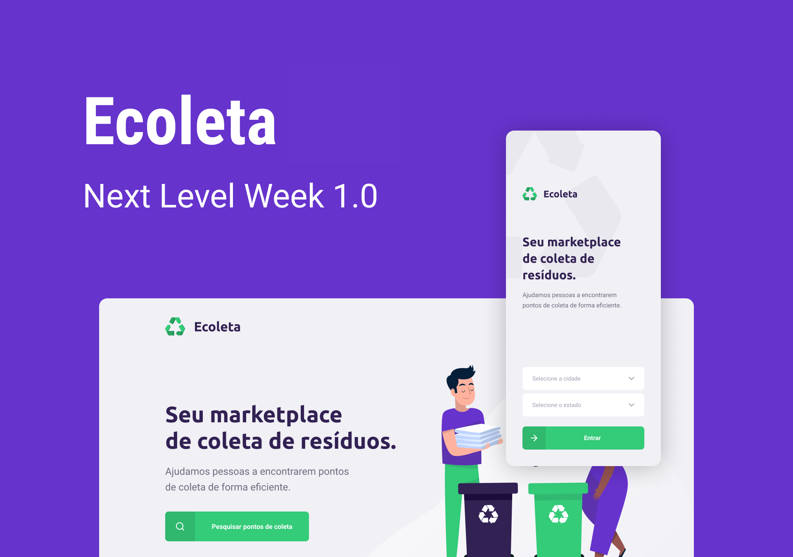

# Ecoleta

## Projeto

O projeto foi desenvolvido durante a NLW 1.0 Booster.
O Ecoleta é um marketplace para ajudar pessoas encontrar um ponto de coleta de forma eficiente.

## Tecnologias

O projeto foi desenvolvido com as tecnologias:

- [Node.js](https://nodejs.org/en/) (backend)
- [React JS](https://reactjs.org/) (frontend)
- [React Native](https://reactnative.dev/) (mobile)

## Como testar

1. Clone e entre no diretório do projeto
2. Verifique o guia de cada ambiente específico: [backend](/backend), [web](/web) e [mobile](/mobile)

## Licença

O projeto esta sob a [licença](/LICENSE) MIT.
